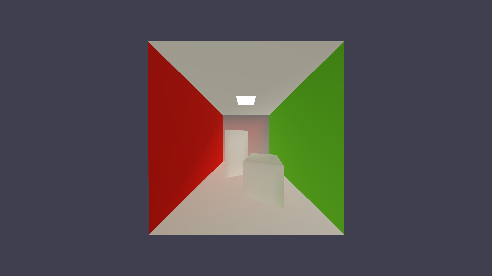

OBJ Viewer with Raytracing and SH Lighting  
Binned Surface Area Heuristic BVH from [jbikker's amazing tutorial series](https://jacco.ompf2.com/2022/04/13/how-to-build-a-bvh-part-1-basics/)  
Used [fast_obj](https://github.com/thisistherk/fast_obj) to parse and load OBJ files  
Native Win32 Windowing  
Python bindings  
`sh_engine.orbit_render(obj_path="assets/CornellBox/CornellBox-Empty-CO.obj", bounces=20, width=3840, height=2160)`  
Blender scripting or app for custom OBJ creation  
Option to save image files with ffmpeg  

Robin Green SH Lighting  
Rendering Equation  
    - Diffuse Unshadowed  
    - Diffuse Shadowed  
    - Diffuse Shadowed Transfer  